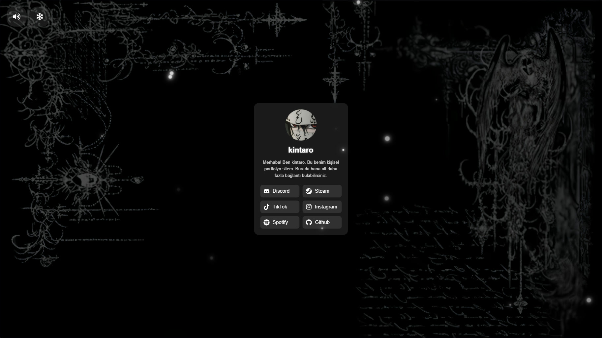

<a href="README.md">
 
</a>
<a href="README-TR.md">
 
</a>

  <br />
  <br />

<div align="center">
  
  <br />
  <br />

  <p>
    A modern, interactive Biolink and Personal Portfolio Website
  </p>


  <p>
    <a href="#features">Features</a> •
    <a href="#technologies">Technologies</a> •
    <a href="#installation">Installation</a> •
    <a href="#license">License</a> •
    <a href="#gallery">Gallery</a>
  </p>

  <br />
  <br />
</div>

## 📷 Demo Link

- [https://xkintaro.github.io/kintaro-links/](https://xkintaro.github.io/kintaro-links/)

## <a id="about"></a>📋 About

**Kintaro Links** is a personalized landing page designed to showcase your social media presence in style. It offers an immersive experience with dynamic background visuals, integrated music playback, and atmospheric effects.

## <a id="features"></a>✨ Features

### 🎧 Immersive Audio Experience

- **Click-to-Enter Overlay**: A cinematic entry experience that initializes audio playback.
- **Dynamic Volume Control**: Smooth volume slider with hover interactions.
- **Mute/Unmute**: Quick toggle for audio control.

### ❄️ Atmospheric Effects

- **Snowfall System**: A toggleable, high-performance particle snow effect to enhance the visual mood.
- **Real-time Notifications**: Instant feedback when effects are toggled on or off.

### 🔗 Social Hub

- **Smart Link Grid**: Responsive layout that automatically switches between grid and column views based on the number of links.
- **Animated Interactions**: Hover effects and transitions for all social icons (Discord, Steam, TikTok, Instagram, Spotify, GitHub).

### 🎨 Premium Design

- **Glassmorphism UI**: Modern aesthetic with blurred backgrounds and sleek card designs.
- **Fully Responsive**: Optimized for desktop and mobile devices.
- **Dark Mode Aesthetic**: A deep, curated color palette designed for high-end visual appeal.

## 🛠️ Technologies <a id="technologies"></a>

The project utilizes a modern development stack focused on speed and developer experience:

- **React 19**: Leveraging the latest features of the world's most popular UI library.
- **Vite**: Next-generation frontend tooling for lightning-fast development.
- **React Icons**: Comprehensive icon set for social and UI elements.
- **Vanilla CSS**: Custom, optimized styling without the overhead of heavy frameworks.

## 🚀 Installation <a id="installation"></a>

Follow these steps to get the project running locally:

1. **Clone the Repository:**

   ```bash
   git clone https://github.com/xkintaro/kintaro-links.git
   cd kintaro-links
   ```

2. **Install Dependencies:**

   ```bash
   npm install
   ```

3. **Start the Development Server:**
   ```bash
   npm run dev
   ```
   You can view the project by navigating to `http://localhost:5173` in your browser.

## 📄 License <a id="license"></a>

This project is licensed under the MIT License. See the [LICENSE](LICENSE) file for details.

## 🖼️ Gallery <a id="gallery"></a>



#


#

<p align="center">
  <sub>❤️ Developed by "Mustafa TAŞAL" (kintaro)</sub>
</p>
